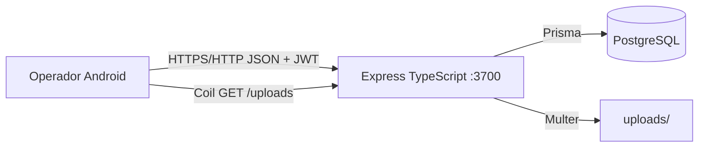
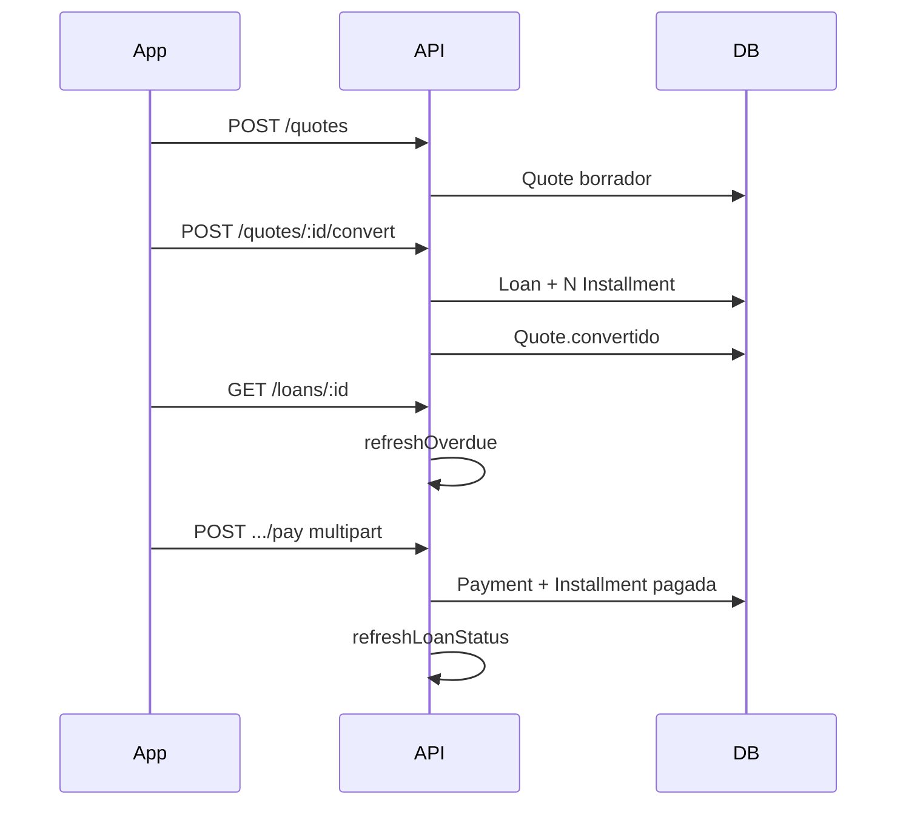

# Arquitectura — Credimax

Documento para un especialista de desarrollo. Describe cómo está armado el sistema, no el negocio (eso está en [DOMAIN.md](DOMAIN.md)) ni el contrato HTTP (está en [API.md](API.md)).

## Propósito

Credimax es una plataforma de **microcréditos semanales** operada por un único administrador. No hay app para el cliente final ni multi-tenant. El operador da de alta personas, arma presupuestos, los convierte en préstamos, registra pagos con comprobante y consulta la cartera.

## Vista de componentes



| Pieza | Tecnología | Rol |
|-------|------------|-----|
| `backend/` | Node 18.9+ / Express 5, TypeScript, Prisma 6, Zod, JWT, Multer | Fuente de verdad: reglas, persistencia, archivos. En Linux: PM2, no Docker |
| PostgreSQL | 16 (RDS o local) | Datos. URL en `DATABASE_URL` |
| `android/` | Kotlin, Compose, Material 3, Retrofit, DataStore | Cliente admin. No calcula recargos: los pide a la API |

`docker-compose.yml` levanta un Postgres local (puerto **5433** en este repo, para no chocar con otro Postgres en 5432). El backend en producción/desarrollo actual apunta a RDS vía `.env`.

## Monorepo

```
Credimax/
  backend/          API + Prisma
  android/          app nativa
  docs/             esta documentación
  docker-compose.yml
```

No hay paquete compartido de tipos entre Android y Node. Los DTO de Kotlin en `android/.../data/Models.kt` deben mantenerse alineados a mano con las respuestas JSON.

## Backend

### Arranque

`src/index.ts` carga `dotenv` y escucha `HOST`/`PORT` (default `0.0.0.0:3700`). `createApp()` en `src/app.ts` monta CORS, JSON, estáticos de comprobantes y routers.

### Capas (no hay framework tipo Nest)

| Ruta | Responsabilidad |
|------|-----------------|
| `src/routes/*` | HTTP, validación Zod, orquestación |
| `src/lib/createLoan.ts` | Alta de préstamo + generación de letras |
| `src/lib/lateFee.ts` | Semanas de atraso y recargo |
| `src/lib/loanStatus.ts` | Recalcula letras vencidas y estado del préstamo |
| `src/lib/money.ts` | Redondeo a 2 decimales, split de cuotas, serialización Decimal |
| `src/middleware/auth.ts` | JWT Bearer |
| `src/middleware/error.ts` | `HttpError`, Zod → 400, resto → 500 |

Prisma vive en `src/lib/prisma.ts` (un `PrismaClient`). El schema está en `backend/prisma/schema.prisma`. Migraciones versionadas en `backend/prisma/migrations/`.

### Autenticación

Un único modelo `User`. Seed: `admin@credimax.pe` / `admin123` (bcrypt). Login emite JWT (`JWT_SECRET`, `JWT_EXPIRES_IN`, default 7d). Todas las rutas excepto `GET /health` y `POST /auth/login` usan el middleware `auth`.

No hay refresh token ni roles. Un token válido es admin.

### Archivos

Fotos: `multipart/form-data`. Préstamo campo `imagen` opcional; pago campo `comprobante` opcional (imagen o PDF, máx. 8 MB). Disco local `UPLOAD_DIR` (default `backend/uploads`). URL pública `/uploads/<filename>`. No hay S3 en esta versión.

### Recalculo de mora

No hay cron. `refreshOverdue()` se ejecuta al listar/detalle de préstamos y en reportes. Recorre letras `pendiente`/`atrasada`, escribe `recargoAcumulado` y `estado`, y deriva el estado del `Loan`.

### Scripts útiles

| Script | Qué hace |
|--------|----------|
| `npm run dev` | `tsx watch` |
| `npm run test:calc` | Invariantes de interés/recargo (`scripts/test-calculations.ts`) |
| `npm run test:e2e` | Flujo HTTP contra API local + Prisma (`scripts/verify-flow.ts`) |
| `npx prisma migrate deploy` | Aplica migraciones (RDS / CI) |
| `npx prisma db seed` | Admin + Settings |

Variables: ver `backend/.env.example`. **No commitear** `.env` (contraseñas de RDS, JWT).

RDS exige TLS: `?sslmode=require` en `DATABASE_URL`. El security group de AWS debe permitir el IP de quien corre la API.

## Android

- `applicationId`: `com.credimax.app`
- minSdk 26, compile/target 35
- `BuildConfig.BASE_URL` default `http://10.0.2.2:3700/` (emulador → localhost del host)
- Dispositivo físico: cambiar `BASE_URL` en `app/build.gradle.kts` a la IP LAN
- Cleartext permitido (`network_security_config.xml`) para HTTP local
- Token en DataStore (`TokenStore`); interceptor OkHttp agrega `Authorization`
- UI: Material 3, teal `#0F766E`, ámbar para atraso
- Tabs: Inicio, Clientes, Préstamos, Más (presupuestos, reporte de abiertos, reportes, settings, logout)
- Tocar un cliente abre un menú: editar ficha, ver/crear presupuestos, ver/crear préstamos
- El formulario de presupuesto/préstamo pide el calendario a `GET /preview/installments` (mismas fechas que al emitir)

Pantallas en `ui/screens/*`. Navegación en `ui/navigation/NavGraph.kt`. Sin Hilt: `CredimaxApp.container` (`AppContainer`).

Pago: galería (`GetContent`) o cámara (`TakePicture` + `FileProvider`). El monto a cobrar lo muestra la API (letra + recargo); el cliente no envía el monto, el servidor lo calcula.

## Flujo de datos (préstamo)



## Decisiones y límites (v1)

- Un operador. Sin app de cliente, sin asesores, sin pagos parciales de una letra.
- Interés **flat**, no sistema francés.
- Recargo **no se capitaliza** sobre recargos previos (solo sobre el monto original de la letra).
- Comprobantes en disco local: en un deploy multi-instancia hay que moverlos a object storage.
- Decimales Prisma se serializan a `number` en JSON (`toJson`); Android usa `Double`.

## Cómo extender

1. Cambiar reglas de dinero solo en `backend/src/lib/*` y cubrir con `test:calc`.
2. Nueva ruta: router + Zod + `auth` si no es pública.
3. Nueva pantalla Android: DTO en `Models.kt`, método en `ApiService`, composable + ruta en `NavGraph`.
4. Schema: `prisma migrate dev` y commitear `migrations/`.
